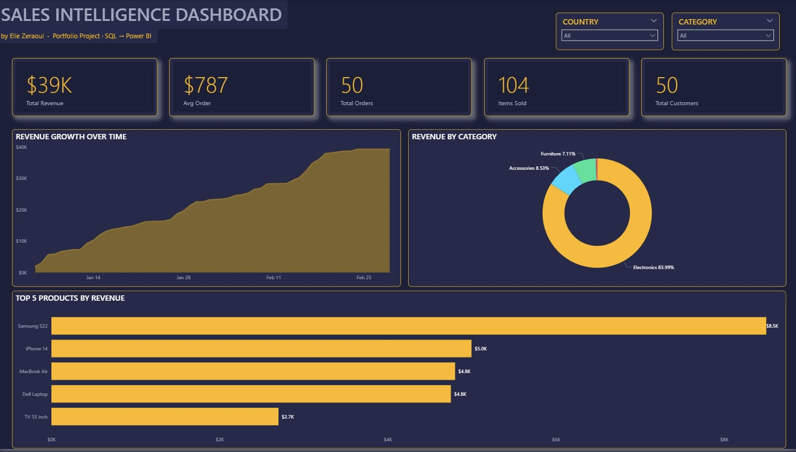

# Sales Intelligence Dashboard

End-to-end sales analytics project built with **SQL Server** and **Power BI**.

## Overview

This project takes raw sales data from a relational database all the way through to an interactive executive dashboard. It demonstrates the full data analyst workflow: database design, querying, modeling, and visualization.

## Tech Stack

- **SQL Server** — relational database design and querying
- **Power BI Desktop** — data modeling and dashboard
- **DAX** — measures and time intelligence
- **Star Schema** — fact + dimension modeling

## What's Inside

- **3 relational tables** — Customers, Products, Orders (120 rows of sample data)
- **25+ SQL queries** covering JOINs across 3 tables, GROUP BY, HAVING, subqueries, and aggregate functions
- **Star schema model** with a dedicated Date table for time intelligence
- **Interactive dashboard** with 5 KPIs, dynamic slicers, trend analysis, and top-performer rankings

## Key Insights

- Electronics drives **84%** of total revenue
- Samsung S22 is the **#1 product** ($8.5K)
- Average order value: **$787** across 50 customers
- Total revenue: **$39K** from 50 orders

## Files in This Repository

| File | Description |
|------|-------------|
| `sales_analysis_queries.sql` | SQL Server queries — table creation + 25+ analysis queries |
| `Sales_Dashboard.pbix` | Power BI dashboard file (open with Power BI Desktop) |
| `Sales_Dashboard.jpg` | Dashboard preview image |

## See It on LinkedIn

[View the project post on LinkedIn](https://linkedin.com/posts/elie-zeraoui-7a5a04267_dataanalytics-powerbi-sql-activity-7458472091533656064-9Z6Q)

---

Built by **[Elie Zeraoui](https://github.com/elie-zeraoui)** — Data Analyst | Computer Science Graduate
